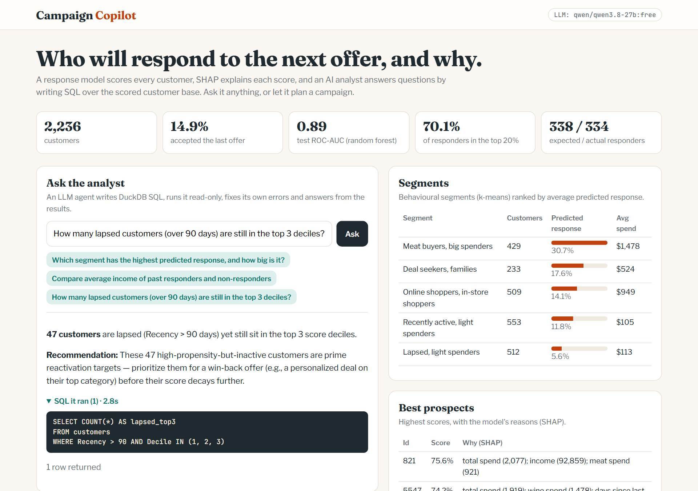
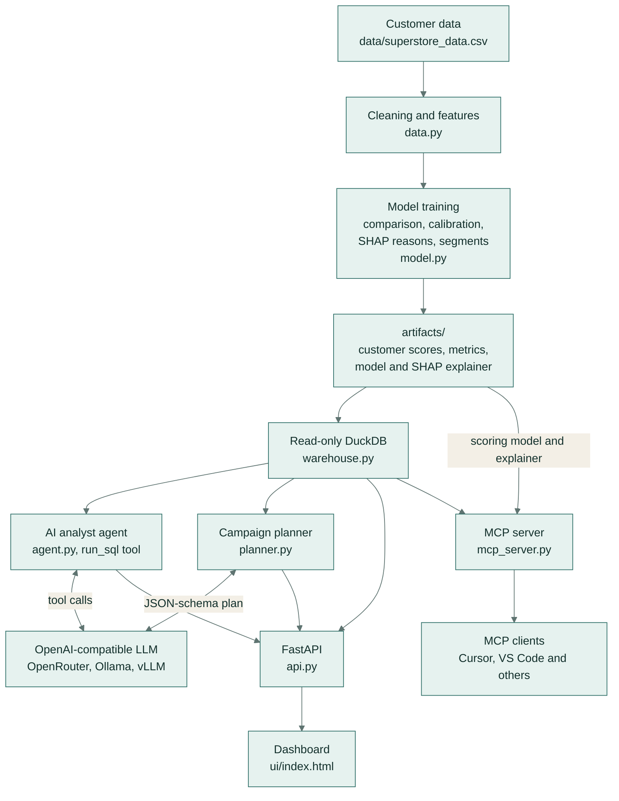
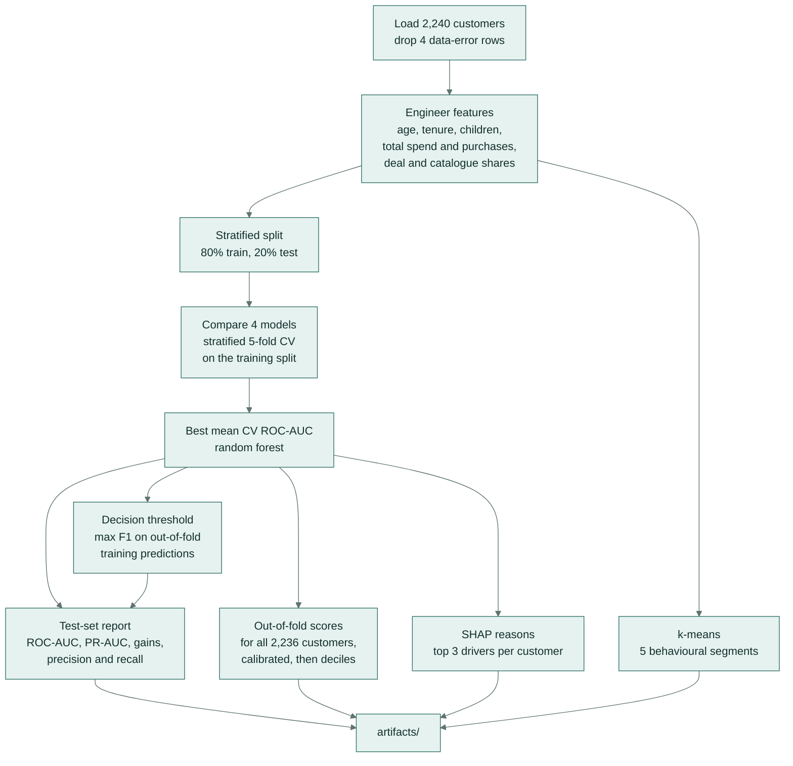
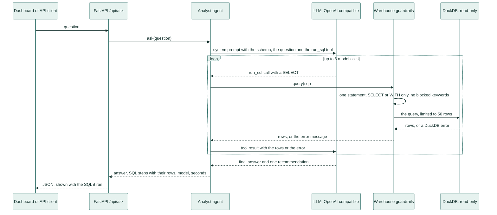
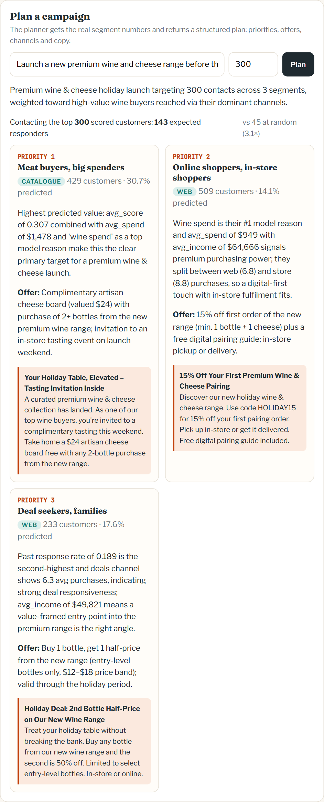
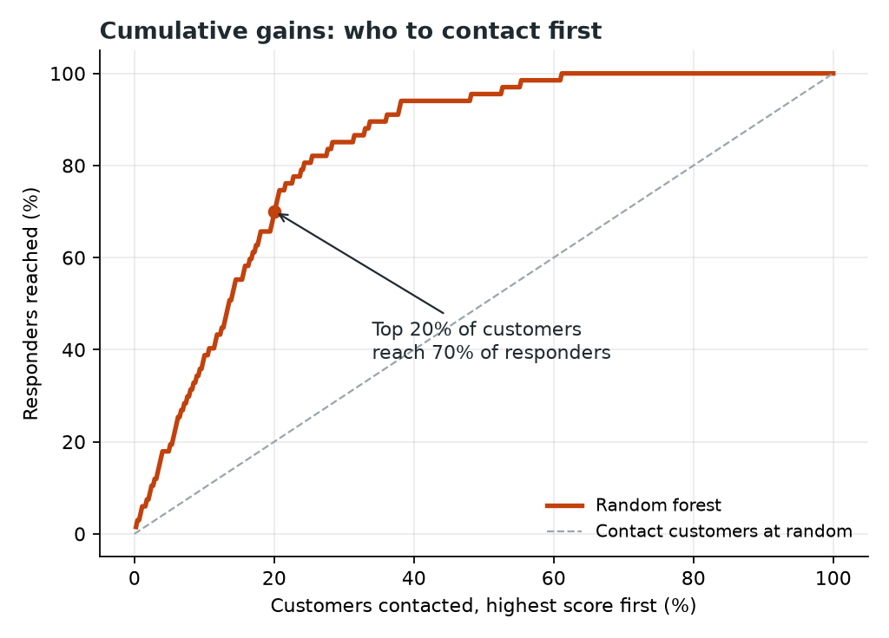
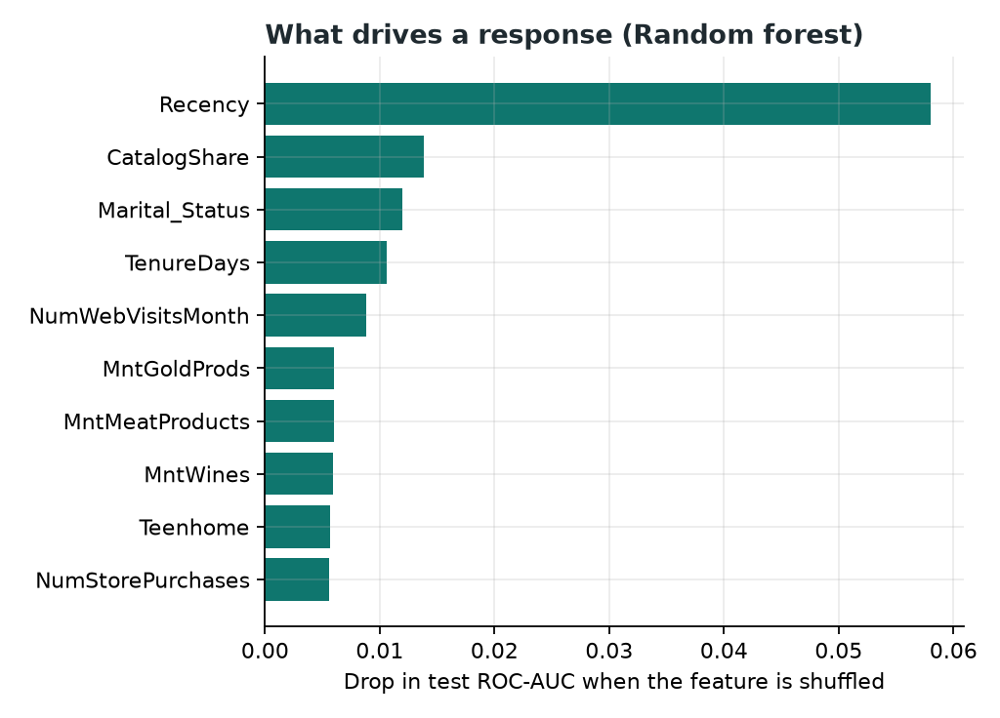
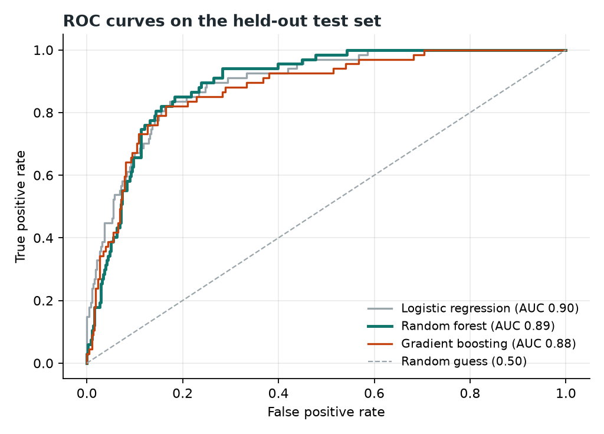
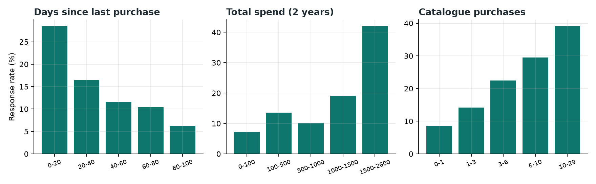

# Campaign Copilot: AI agent + ML for marketing campaign targeting


**Predict which customers will respond to a marketing offer, explain every prediction, and ask an AI analyst
agent questions about the customer base in plain English.** A propensity model with SHAP explanations, a
tool-calling LLM agent that writes and runs SQL on DuckDB, an AI campaign planner with structured output,
and an MCP server so any AI assistant that speaks the Model Context Protocol can use it all as tools. It is built for
marketing and CRM teams who need to decide who to contact and why, and it runs on the public Superstore Marketing
Campaign dataset of 2,240 grocery customers.



## Key features

- **Response model:** a random forest chosen by stratified 5-fold cross-validation over logistic regression and
  gradient boosting. **Test ROC-AUC 0.89**; contacting the top 20% of customers reaches **70% of all responders**,
  3.5 times the random rate.
- **Out-of-fold scores:** every customer is scored by a model trained on the other folds, so no score comes from a
  model that saw that customer. The scores are calibrated probabilities: they add up to **338 expected responders
  against 334 actual**.
- **Explainable:** SHAP gives every customer plain-English reasons, for example *"total spend (2,077); income
  (92,859); meat spend (921)"*.
- **Behavioural segments:** k-means clusters named after their two most distinctive traits, such as "Meat buyers, big
  spenders".
- **AI analyst agent:** LLM tool calling plus DuckDB text-to-SQL with read-only guardrails. A failed query goes back to
  the model with its error so the model can correct it, and every answer comes with the SQL it ran. **12/12 correct**
  on a gold-SQL evaluation with GPT-4.1-mini and with a free-tier Qwen model (median 2.0 s and 3.2 s per question).
- **AI campaign planner:** structured JSON output (JSON Schema) with priorities, offers, channels and message copy,
  grounded in segment numbers computed in code.
- **MCP server:** 5 tools and a schema resource over the Model Context Protocol (FastMCP), usable from any MCP client.
- **Dashboard, REST API and command line:** FastAPI serves a single-page dashboard, and every step runs from
  `python -m campaign_copilot`.
- **Any OpenAI-compatible LLM:** OpenRouter by default, or OpenAI, or a local Ollama, vLLM or LM Studio server.

## Architecture



| Component | Role |
|---|---|
| `data.py` | loads the CSV, removes rows with data errors and engineers features |
| `model.py` | compares models, picks a decision threshold, scores every customer out-of-fold, adds SHAP reasons and k-means segments, and writes `artifacts/` |
| `warehouse.py` | loads the scored customers into an in-memory DuckDB database (a `customers` table and a `segments` view) and locks it for read-only SQL |
| `agent.py` | the AI analyst: a tool-calling loop in which the LLM writes SQL, reads the rows or the error, and answers |
| `planner.py` | the AI campaign planner: facts computed in SQL, strategy and copy from the LLM as JSON that matches a schema |
| `api.py`, `ui/index.html` | FastAPI routes and the dashboard |
| `mcp_server.py` | the same data and model as MCP tools; the assistant's own LLM does the reasoning, so no key is needed here |
| `evaluate.py`, `report.py` | the analyst's execution-accuracy evaluation and the evaluation charts |

## How it works

### Training: from raw data to explained scores



1. **Clean.** `data.py` parses the join dates, computes age, removes 4 rows with data errors and merges
   marital-status and education labels into fewer groups (for example "Together" into "Married" and "2n Cycle" into
   "Master").
2. **Engineer features:** age, customer tenure, children at home, total spend, total purchases, and the shares of
   purchases made on deals and from the catalogue. `Id` is kept for look-ups but is never a feature.
3. **Compare models.** A stratified 80/20 split (seed 42) sets aside a test set. Four pipelines (median imputation
   and scaling for numbers, one-hot encoding for education and marital status) are compared by stratified 5-fold
   cross-validation on the training split: an always-"no" baseline, logistic regression, a random forest (400 trees)
   and histogram gradient boosting. The three real models are class-weighted for the 15% response rate, and the best
   mean CV ROC-AUC wins.
4. **Pick a threshold.** The decision threshold (0.319) maximises F1 on out-of-fold predictions for the training
   split, so the test set plays no part in choosing it.
5. **Report on the test set,** once: ROC-AUC, PR-AUC, the gains curve, and precision and recall at the threshold.
6. **Score every customer out-of-fold.** 5-fold cross-validated predictions give each of the 2,236 customers a score
   from a model that never saw them. For the random forest, the scoring model is trained without class weighting
   (class weights help ranking but inflate probabilities); other model types are wrapped in sigmoid calibration. Customers are then
   ranked into deciles, 1 being the best tenth.
7. **Explain.** SHAP (`TreeExplainer`) on the best model refit on all customers gives the three features that push
   each customer's score up most, with one-hot columns folded back into their original feature and written in plain
   English with the customer's value.
8. **Segment.** k-means (k = 5) on 11 standardised spend, channel and family features; each segment is named after
   the two traits that set it apart from the average customer.
9. **Save** `artifacts/customers.parquet` (scores, deciles, segments, reasons), `model.joblib` (the scoring model,
   for new customers), `explainer.joblib` and `metrics.json`.

### Asking the analyst



The system prompt describes every column, tells the model to answer only with numbers it obtained from `run_sql`,
and asks for a short answer and one practical recommendation. When a query fails, the error goes back to the model as
the tool result, so it can fix the query and try again. The `ask` command and `eval` call the same agent directly,
without the API.

**Guardrails for LLM-written SQL:** one statement only, `SELECT`/`WITH` only, a blocklist for write and side-effect
keywords, and DuckDB itself locked with `enable_external_access = false` and `lock_configuration = true`, so even a
cleverly written `SELECT` can't read files or reach the network. Tests cover `DROP`, `DELETE`, `COPY`, `ATTACH`,
`INSTALL`, `SET`, `read_csv` and multi-statement injection.

### Planning a campaign

1. **Facts in code.** `planner.py` runs SQL for each segment's size, average score, past response rate, spend, income
   and recency, the three most common SHAP reasons among its customers in the top three deciles, and its average
   purchases by channel. It also computes the expected responders when the top-scored customers within the contact
   budget are contacted, against contacting the same number at random.
2. **Strategy from the LLM.** The model gets the goal and these facts, and must answer with JSON that matches a strict
   schema: a summary, then for each segment a priority, a reason that cites the numbers, an offer, a channel (email,
   catalogue, web, in-store or SMS), a subject line and a message.
3. **Checked against the data.** Segments the model names that don't exist are dropped, the rest are sorted by
   priority, and each gets its real numbers attached.

## Screenshots

<table>
<tr>
<td width="58%" valign="top"></td>
<td width="42%" valign="top"></td>
</tr>
<tr>
<td valign="top"><b>Dashboard.</b> KPIs from the training run, the AI analyst answering a question with the SQL it ran, the segments ranked by predicted response, and the best prospects with their SHAP reasons.</td>
<td valign="top"><b>Campaign planner.</b> A plan for a premium wine and cheese launch with a budget of 300 contacts: 143 expected responders against 45 at random, with an offer, a channel and message copy for each segment.</td>
</tr>
</table>

## Results

**Model comparison** (2,236 customers, 14.9% responded; stratified 5-fold CV on the 80% training split, untouched 20%
test set):

| Model | CV ROC-AUC | Test ROC-AUC | Test PR-AUC |
|---|---|---|---|
| Baseline (always "no") | 0.500 | 0.500 | 0.150 |
| Logistic regression | 0.846 | 0.895 | 0.635 |
| **Random forest** (selected on CV) | **0.863** | 0.893 | 0.545 |
| Gradient boosting | 0.860 | 0.876 | 0.545 |

At the decision threshold the model finds **78% of responders with 51% precision**, against a 15% base rate. Ranking
the test set by score:

| Contact the top | Responders reached |
|---|---|
| 10% | 38.8% |
| 20% | **70.1%** |
| 30% | 85.1% |
| 50% | 95.5% |

**Calibration:** the out-of-fold scores of all 2,236 customers add up to 338.1 expected responders against 334 actual,
with a Brier score of 0.091.

| Who to contact first | What drives a response |
|---|---|
|  |  |
| **Cumulative gains** on the test set, against contacting customers at random. | **Permutation importance:** the drop in test ROC-AUC when each feature is shuffled. |

| ROC curves | Response rate by customer behaviour |
|---|---|
|  |  |
| **ROC curves** of the three models on the held-out test set. | **Observed response rates** by days since last purchase, two-year spend and catalogue purchases. |

**How it's measured.** The test set is 20% of customers, split off with a fixed seed and used once, for the numbers
above. Models are ranked by mean ROC-AUC over stratified 5-fold cross-validation on the training split; accuracy
isn't used, because answering "no" for everyone already scores 85%. The decision threshold comes from out-of-fold
training predictions. `python -m campaign_copilot train` prints these metrics and saves them to
`artifacts/metrics.json`, and `python -m campaign_copilot report` redraws the charts.

**AI analyst evaluation** ([`eval/results.md`](eval/results.md)): 12 business questions with gold SQL in
[`eval/questions.jsonl`](eval/questions.jsonl), scored by execution accuracy.

| LLM | Execution accuracy | Median time per question |
|---|---|---|
| `openai/gpt-4.1-mini` | **12/12** | 2.0 s |
| `qwen/qwen3.8-27b:free` (free tier) | **12/12** | 3.2 s |

For each question the gold SQL runs on the same database, and the agent is correct when every value in the gold result
appears in what the agent produced: the rows its own queries returned or the numbers in its final answer. Numbers
match when the agent's value is a correct rounding of the gold value, so 14.9% matches 0.1494 and $60,210 matches
60,209.68. Text matches exactly, ignoring case, and grouping labels such as `Response` 0/1 aren't scored. Each model's
full run is saved in `eval/runs/`.

## Tech stack

Python · scikit-learn · SHAP · pandas · DuckDB · OpenAI Python SDK with OpenAI-compatible APIs (OpenRouter, Ollama,
vLLM) · tool calling · JSON Schema structured outputs · FastMCP (Model Context Protocol) · FastAPI · Uvicorn ·
Matplotlib · pytest · Ruff · GitHub Actions

**Keywords:** AI agent, LLM agent, text-to-SQL, agentic analytics, tool calling, function calling, MCP server,
propensity modelling, customer response prediction, marketing analytics, CRM, explainable AI (XAI), SHAP,
probability calibration, customer segmentation, k-means, DuckDB, FastAPI, data science.

## Getting started

### Prerequisites

- Python 3.10 or newer (CI uses 3.11).
- For the AI analyst, the planner and `eval`: an OpenRouter API key, or any OpenAI-compatible endpoint whose model
  supports tool calling and JSON-schema output (OpenAI, or a local Ollama, vLLM or LM Studio server). Training, the
  dashboard's metrics, segments and prospects, `eval --rescore` and the MCP server need no key.

### Install, train and run

```bash
git clone https://github.com/samiulhuda360/marketing-campaign-ai-copilot
cd marketing-campaign-ai-copilot
pip install -e ".[dev]"
cp .env.example .env                  # then add OPENROUTER_API_KEY, or set LLM_BASE_URL for a local server
python -m campaign_copilot train      # about 1 to 2 minutes: compare models, score and explain customers, segments
python -m campaign_copilot serve      # dashboard and API on http://127.0.0.1:8000
```

`train` writes `artifacts/` and prints the metrics; `serve`, `ask`, `plan`, `eval` and `mcp` read from it.

### Configuration

Settings come from environment variables or a `.env` file in the project folder (see
[`.env.example`](.env.example)):

| Variable | Default | Purpose |
|---|---|---|
| `OPENROUTER_API_KEY` | | API key for OpenRouter, the default endpoint |
| `LLM_API_KEY` | | API key for another OpenAI-compatible endpoint; used instead of `OPENROUTER_API_KEY` when set |
| `LLM_BASE_URL` | `https://openrouter.ai/api/v1` | the endpoint, for example `http://localhost:11434/v1` for Ollama |
| `LLM_MODEL` | `openai/gpt-4.1-mini` | the model name at that endpoint |
| `LLM_MAX_TOKENS` | `900` | token limit for each LLM reply (the planner allows at least 4,000) |
| `COPILOT_DATA` | `data/superstore_data.csv` | the customer CSV |
| `COPILOT_ARTIFACTS` | `artifacts/` | where training writes the scores, models and metrics |
| `EVAL_PAUSE` | `0` | seconds to wait between evaluation questions, for rate-limited free tiers |

For a free option, `LLM_MODEL=qwen/qwen3.8-27b:free` on OpenRouter scored 12/12 (rate-limited). For a fully local
setup, run Ollama and set `LLM_BASE_URL=http://localhost:11434/v1` and `LLM_MODEL` to a local model with tool calling.

## Usage

### Command line

| Command | What it does |
|---|---|
| `python -m campaign_copilot train` | compare models, score and explain every customer, build segments, write `artifacts/` |
| `python -m campaign_copilot serve [--port 8000]` | dashboard and REST API on http://127.0.0.1:8000 |
| `python -m campaign_copilot ask "Which segment should get a wine offer, and why?"` | ask the AI analyst; prints each SQL query it ran, then the answer |
| `python -m campaign_copilot plan "Launch a premium wine range" --budget 300` | campaign plan as JSON for a contact budget (default 300) |
| `python -m campaign_copilot eval` | run the analyst with `LLM_MODEL` on the 12 evaluation questions and rewrite `eval/results.md` |
| `python -m campaign_copilot eval --rescore` | score the saved runs in `eval/runs/` again, without model calls |
| `python -m campaign_copilot report` | redraw the charts in `docs/figures/` |
| `python -m campaign_copilot mcp` | run the MCP server over stdio |

### Dashboard

Open http://127.0.0.1:8000 after `serve`. The top row shows the training metrics. **Ask the analyst** takes a
question (or one of three examples) and shows the answer with the SQL behind it. **Plan a campaign** takes a goal and a
contact budget. **Segments** ranks the behavioural segments by predicted response, and **Best prospects** lists the
six highest-scored customers with their SHAP reasons.

### REST API

| Method and path | Body or query | Returns |
|---|---|---|
| `GET /` | | the dashboard |
| `GET /api/overview` | | training metrics, segments and the configured LLM |
| `POST /api/ask` | `{"question": "..."}`, 3 to 400 characters | the answer, each SQL step with its rows or error, the model and the seconds taken |
| `POST /api/plan` | `{"goal": "...", "budget": 300}`, budget 10 to 2,000 | the plan: summary, prioritised segments with their real numbers, and expected responders for top-scored and random contact |
| `GET /api/customers/top` | `?segment=&limit=10`, limit up to 50 | the highest-scored customers with their reasons |
| `GET /api/customers/{id}` | | one customer's full row: features, score, decile, segment and reasons |
| `GET /docs` | | interactive OpenAPI docs |

The API returns 503 until a model has been trained, 502 with the provider's message when an LLM call fails, and 404
for an unknown customer id.

### MCP server

| Tool | What it returns |
|---|---|
| `run_sql(sql)` | the rows of one read-only `SELECT` on the `customers` table or `segments` view, up to 50 |
| `segment_summary()` | every segment with its size, average score, past response rate, spend, income and recency |
| `top_customers(segment, limit)` | the customers most likely to respond, optionally within one segment, with reasons (20 by default, up to 50) |
| `explain_customer(customer_id)` | one customer's score, decile, segment, reasons, recency, spend and income |
| `score_new_customer(customer)` | the response probability and reasons for a customer who isn't in the data; missing fields take typical values |

The resource `campaign://schema` lists the tables and what each column means. To connect a client, register the
server's command. In Cursor, for example, add this to `.cursor/mcp.json`:

```json
{
  "mcpServers": {
    "campaign-copilot": { "command": "python", "args": ["-m", "campaign_copilot", "mcp"] }
  }
}
```

Use the Python interpreter where you installed the package; for a virtual environment, give the full path to its
`python`. Then ask the assistant things like *"Which segment has the most high-scoring customers who haven't bought in
60 days?"*: it can read the schema resource and call `run_sql` and the other tools itself.

## Project structure

```
.
├── campaign_copilot/
│   ├── data.py          loads the CSV, removes data errors, engineers features
│   ├── model.py         model comparison, threshold, out-of-fold scores, SHAP reasons, k-means segments
│   ├── warehouse.py     in-memory DuckDB with SQL guardrails
│   ├── agent.py         AI analyst: tool-calling loop around run_sql
│   ├── planner.py       AI campaign planner with JSON-schema output
│   ├── mcp_server.py    FastMCP server: 5 tools and a schema resource
│   ├── api.py           FastAPI routes for the dashboard
│   ├── evaluate.py      execution-accuracy evaluation of the analyst
│   ├── report.py        evaluation charts for docs/figures
│   ├── config.py        settings from environment variables and .env
│   └── __main__.py      command line: train, serve, ask, plan, eval, report, mcp
├── ui/index.html        dashboard (no build step)
├── data/                superstore_data.csv, 2,240 customers
├── eval/                questions.jsonl (gold SQL), runs/ (one file per LLM), results.md
├── docs/                figures/ (evaluation charts) and screenshots/
├── tests/               21 tests with a scripted fake LLM, no API key needed
├── original/            exploratory notebook from 2023 group coursework, kept as submitted
├── .env.example         LLM settings template
├── pyproject.toml       package metadata, dependencies and Ruff settings
└── .github/workflows/   CI: Ruff, pytest and an end-to-end training run
```

`python -m campaign_copilot train` creates `artifacts/` (scores, models and metrics), which is not committed.

## Testing

```bash
pip install -e ".[dev]"
ruff check .
pytest -q
```

The 21 tests run offline: a scripted fake LLM stands in for the model, so no API key or network is needed. They
cover:

- **Data:** cleaning leaves 2,236 customers with plausible ages and incomes, adds the engineered features, and keeps
  `Id` and `Response` out of the features.
- **SQL guardrails:** `SELECT` queries work; `DROP`, `DELETE`, multi-statement injection, `COPY`, `INSTALL`, `ATTACH`
  and `SET` are refused; `read_csv` is blocked by DuckDB itself; blocked words inside string literals are allowed.
- **Agent:** runs SQL and answers from the rows, sees its own SQL error and recovers, refuses destructive SQL and tells
  the model, and stops at the step limit.
- **Planner:** returns a structured plan sorted by priority, drops invented segments and computes expected responders
  in code.
- **Evaluation scorer:** accepts correct roundings and percentages and rejects wrong numbers.
- **API:** overview, top customers and single customers, a 404 for unknown ids, a segment filter that resists SQL
  injection, LLM failures turned into readable 502 errors, and the dashboard page.

**CI** ([`.github/workflows/ci.yml`](.github/workflows/ci.yml)) runs on every push and pull request: it installs the
package on Python 3.11, runs `ruff check .` and `pytest -q`, then trains end to end with
`python -m campaign_copilot train`.

## Data

The **Superstore Marketing Campaign** dataset (public, from Kaggle), in `data/superstore_data.csv`: 2,240 customers
of a grocery superstore with 22 columns covering demographics, two years of spend by product category, purchases by
channel, web visits, complaints, and `Response` (1 if the customer accepted the last campaign offer). Cleaning
removes 4 rows with data errors (three birth years before 1901 and one income of 666,666), which leaves 2,236
customers.

## Licence

MIT, see [LICENSE](LICENSE).

The exploratory notebook in [`original/`](original/) is 2023 group coursework by Md. Mohidul Islam, Mohammad Atik
Ibna Shams, Quazi Raihan Shahriar, Md Samiul Huda and Milton Raj Bonghsi.

## Author

[Samiul Huda](https://github.com/samiulhuda360) · MSc Data Science · Auckland, New Zealand
